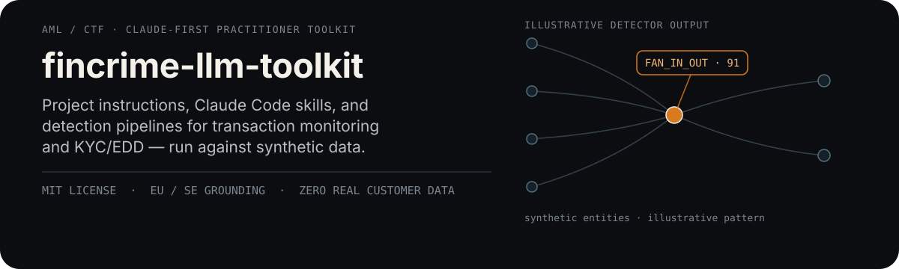
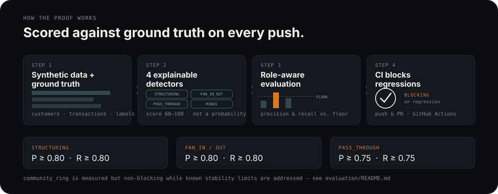

<p align="center">
  
</p>

<p align="center">
  <a href="LICENSE"></a>
  <a href="https://github.com/overjoyde/fincrime-llm-toolkit/actions/workflows/ci.yml"></a>
  <a href=".github/workflows/ci.yml"></a>
</p>

A practitioner toolkit for using LLMs in Transaction Monitoring (TM),
KYC/EDD, and financial-crime compliance work — built by someone who does
this job, for people who do this job.

## Proof, not prompts

<p align="center">
  
</p>

Every detector in `pipelines/detectors/` runs against synthetic
transactions with known ground truth, and
[`evaluation/evaluate.py`](evaluation/README.md) checks precision and
recall per typology — not overall accuracy, and not against roles a
detector was never meant to catch. [`.github/workflows/ci.yml`](.github/workflows/ci.yml)
runs this on every push and pull request; structuring, fan-in/out, and
pass-through are **blocking** — a regression below their floor fails CI.
Community-ring detection is measured but not yet blocking while its
known stability limitations are addressed (see `evaluation/README.md`).

Detector output is a `score` from 60–100: an alert-prioritization measure
showing how strongly an observation exceeded the detector's triggering
conditions, not a probability of money laundering. See
`pipelines/README.md` for the full score contract and each detector's
logic.

## What this is

Working assets you can clone and use on day one:

- **Project instructions** you paste into Claude.ai Projects to get a
  TM analyst, KYC/EDD reviewer, regulatory-watch, or rule-tuning assistant
  that already knows the vocabulary and the guardrails.
- **Claude Code skills** that run real detection logic (structuring,
  fan-in/out, pass-through, network communities) against synthetic data,
  not just prompts that describe what those things are.
- **A grounding layer** — EU and Swedish AML instruments with direct links,
  and an MCP setup so Claude can query a local database instead of you
  pasting spreadsheets into a chat window.
- **A synthetic data generator** with injected typologies and ground truth,
  so you can test every prompt and skill in this repo without touching a
  single real record.

## What this isn't

- Not legal advice, and not a substitute for your institution's policies,
  your regulator's guidance, or your MLRO's sign-off.
- Not a SAR/STR filing tool. Nothing here submits anything anywhere.
- Not a vendor pitch. No affiliate links, no "book a demo." If something
  needs a paid product to work, `grounding/resources.md` says so plainly.
- Not a replacement for the link-collection genre — `grounding/resources.md`
  *is* a curated list, but everything else here is meant to be run, not read.

## Why Claude, and why this still isn't locked in

The profiles, prompts, and skills are written and tested against Claude
(Claude.ai Projects and Claude Code specifically) because that's the
day-to-day tool this repo's maintainers use. But none of it is Claude-only
by design — a Project-instructions block is just a system prompt, and a
Claude Code skill is a folder with a markdown file and a script. Every asset
that isn't Claude-specific by nature carries a **Portability** note pointing
at the ChatGPT/Gemini equivalent. See `docs/06-portability.md` for the general
mapping.

## Quickstart (5 minutes)

1. **Read `docs/01-data-hygiene.md` first.** Before you paste anything into
   any LLM, know what you're allowed to paste. This is the one document in
   this repo that isn't optional reading.
2. Generate synthetic data to work against:
   ```bash
   cd data && pip install -r ../pipelines/requirements.txt
   python synthetic_generator.py --customers 500 --months 6 --out generated/
   ```
3. Run the detection pipeline against it:
   ```bash
   cd ../pipelines && python run_pipeline.py --input ../data/generated/transactions.csv
   ```
4. Pick a role from `profiles/` (start with `tm-analyst.md` if you triage
   alerts day to day), paste its Project Instructions block into a new
   Claude.ai Project, and attach the pipeline's output as a knowledge file.
5. If you use Claude Code locally, copy the relevant folder(s) from `skills/`
   into your project's `.claude/skills/` (or wherever your Claude Code setup
   expects skills) and try the matching prompt from `prompts/`.

## Repository layout

```
fincrime-llm-toolkit/
├── docs/         Setup guides — data hygiene, Claude.ai, Claude Code, MCP,
│                 model selection, portability
├── profiles/     Paste-ready Claude Project instructions per role
├── skills/       Claude Code skills (real code, not just prompts)
├── prompts/      Single-task prompt templates with example input/output
├── grounding/    EU + Swedish source registers, plus curated resources.md
├── pipelines/    Python detection logic run against synthetic data
├── evaluation/   Role-aware precision/recall scoring against ground truth
├── data/         Synthetic transaction generator + sample dataset
└── mcp/          MCP config examples (filesystem, SQLite) as a grounding layer
```

## Scope and jurisdiction

Written from an EU/Swedish regulatory vantage point (AMLR/AMLD6/AMLA, PTL
2017:630, FFFS 2017:11). The detection logic and prompting patterns
generalize; the citations in `grounding/` don't. If you're working under a
different regime, treat `grounding/` as a template to replace, not a source
of truth for your jurisdiction.

## License

MIT — see `LICENSE`. Use it, fork it, put your own institution's typologies
in it. Just don't put real customer data in it, anywhere, ever.

## Contributing

See `CONTRIBUTING.md`. No real data, no vendor pitches, label your jurisdiction.
